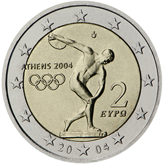

# Greece € 2.00

## Images

## Metadata

**Country:** [Greece](../../Countries/Greece/index.md)\
**Monetary value:** € 2.00\
**Currency:** Euro\
**Issue date:** 2004-05-12

## Description

Olympic Games in Athens 2004

## Mintages

| Year | Mintmark | Circulated | Brilliant Uncirculated | Proof  |
| ---- | -------- | ---------- | ---------------------- | ------ |
| 2004 |          | 34500000   | 500000                 | 0      |
