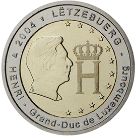

# Luxembourg € 2.00

## Images

## Metadata

**Country:** [Luxembourg](../../Countries/Luxembourg/index.md)\
**Monetary value:** € 2.00\
**Currency:** Euro\
**Issue date:** 2004-07-26

## Description

Effigy and monogram of Grand-Duke Henri

## Mintages

| Year | Mintmark | Circulated | Brilliant Uncirculated | Proof |
| ---- | -------- | ---------- | ---------------------- | ----- |
| 2004 |          | 2447000    | 10000                  | 0     |
