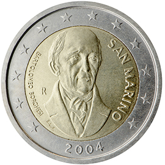

# San Marino € 2.00

## Images

## Metadata

**Country:** [San Marino](../../Countries/San Marino/index.md)\
**Monetary value:** € 2.00\
**Currency:** Euro\
**Issue date:** 2004-12-16

## Description

Bartolomeo Borghesi (historian, numismatist)

## Mintages

| Year | Mintmark | Circulated | Brilliant Uncirculated | Proof |
| ---- | -------- | ---------- | ---------------------- | ----- |
| 2004 |          | 0          | 110000                 | 0     |
