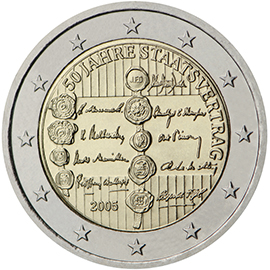

# Austria € 2.00

## Images

## Metadata

**Country:** [Austria](../../Countries/Austria/index.md)\
**Monetary value:** € 2.00\
**Currency:** Euro\
**Issue date:** 2005-05-11

## Description

50th anniversary of the Austrian State Treaty

## Mintages

| Year | Mintmark | Circulated | Brilliant Uncirculated | Proof |
| ---- | -------- | ---------- | ---------------------- | ----- |
| 2005 |          | 6880000    | 100000                 | 20000 |
