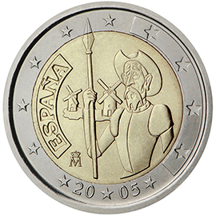

# Spain € 2.00

## Images

## Metadata

**Country:** [Spain](../../Countries/Spain/index.md)\
**Monetary value:** € 2.00\
**Currency:** Euro\
**Issue date:** 2005-06-30

## Description

4th centenary of the first edition of Miguel de Cervantes’ 'The ingenious gentleman Don Quixote of La Mancha'

## Mintages

| Year | Mintmark | Circulated | Brilliant Uncirculated | Proof |
| ---- | -------- | ---------- | ---------------------- | ----- |
| 2005 |          | 8000000    | 0                      | 3000  |
