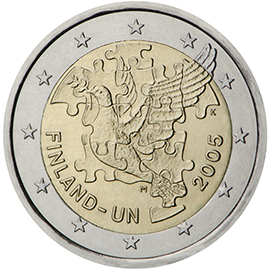

# Finland € 2.00

## Images

## Metadata

**Country:** [Finland](../../Countries/Finland/index.md)\
**Monetary value:** € 2.00\
**Currency:** Euro\
**Issue date:** 2005-10-24

## Description

60th anniversary of the establishment of the United Nations and 50th anniversary of Finland’s membership therein

## Mintages

| Year | Mintmark | Circulated | Brilliant Uncirculated | Proof |
| ---- | -------- | ---------- | ---------------------- | ----- |
| 2005 |          | 2000000    | 0                      | 0     |
