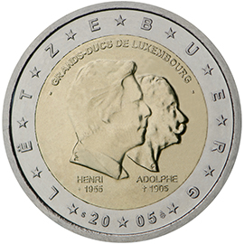

# Luxembourg € 2.00

## Images

## Metadata

**Country:** [Luxembourg](../../Countries/Luxembourg/index.md)\
**Monetary value:** € 2.00\
**Currency:** Euro\
**Issue date:** 2005-02-08

## Description

50th birthday of Grand Duke Henri, 5th anniversary of his accession to the throne and 100th anniversary of the death of Grand Duke Adolphe

## Mintages

| Year | Mintmark | Circulated | Brilliant Uncirculated | Proof |
| ---- | -------- | ---------- | ---------------------- | ----- |
| 2005 |          | 2720000    | 10000                  | 0     |
