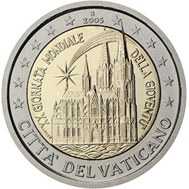

# Vatican City € 2.00

## Images

## Metadata

**Country:** [Vatican City](../../Countries/Vatican City/index.md)\
**Monetary value:** € 2.00\
**Currency:** Euro\
**Issue date:** 2005-12-06

## Description

20th World Youth Day

## Mintages

| Year | Mintmark | Circulated | Brilliant Uncirculated | Proof |
| ---- | -------- | ---------- | ---------------------- | ----- |
| 2005 |          | 15000      | 85000                  | 0     |
