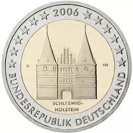

# Germany € 2.00

## Images

## Metadata

**Country:** [Germany](../../Countries/Germany/index.md)\
**Serie:** [German federal states](index.md)\
**Monetary value:** € 2.00\
**Currency:** Euro\
**Issue date:** 2006-02-03

## Description

Federal state of Schleswig-Holstein

## Mintages

| Year | Mintmark | Circulated | Brilliant Uncirculated | Proof  |
| ---- | -------- | ---------- | ---------------------- | ------ |
| 2006 | A        | 6000000    | 90000                  | 75000  |
| 2006 | D        | 6300000    | 90000                  | 75000  |
| 2006 | F        | 7200000    | 90000                  | 75000  |
| 2006 | G        | 4200000    | 90000                  | 75000  |
| 2006 | J        | 6300000    | 90000                  | 75000  |
