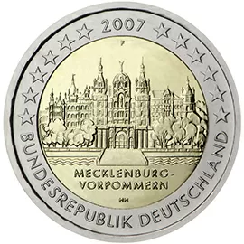

# Germany € 2.00

## Images

## Metadata

**Country:** [Germany](../../Countries/Germany/index.md)\
**Serie:** [German federal states](index.md)\
**Monetary value:** € 2.00\
**Currency:** Euro\
**Issue date:** 2007-02-02

## Description

Federal state of Mecklenburg-Vorpommern

## Mintages

| Year | Mintmark | Circulated | Brilliant Uncirculated | Proof  |
| ---- | -------- | ---------- | ---------------------- | ------ |
| 2007 | A        | 1040000    | 90000                  | 75000  |
| 2007 | D        | 11840000   | 90000                  | 75000  |
| 2007 | F        | 11850000   | 90000                  | 75000  |
| 2007 | G        | 4200000    | 90000                  | 75000  |
| 2007 | J        | 1070000    | 90000                  | 75000  |
