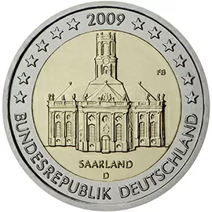

# Germany € 2.00

## Images

## Metadata

**Country:** [Germany](../../Countries/Germany/index.md)\
**Serie:** [German federal states](index.md)\
**Monetary value:** € 2.00\
**Currency:** Euro\
**Issue date:** 2009-02-15

## Description

Federal state of Saarland

## Mintages

| Year | Mintmark | Circulated | Brilliant Uncirculated | Proof |
| ---- | -------- | ---------- | ---------------------- | ----- |
| 2009 | A        | 6000000    | 60000                  | 50000 |
| 2009 | D        | 6300000    | 60000                  | 50000 |
| 2009 | F        | 7200000    | 60000                  | 50000 |
| 2009 | G        | 4200000    | 60000                  | 50000 |
| 2009 | J        | 6300000    | 60000                  | 50000 |
