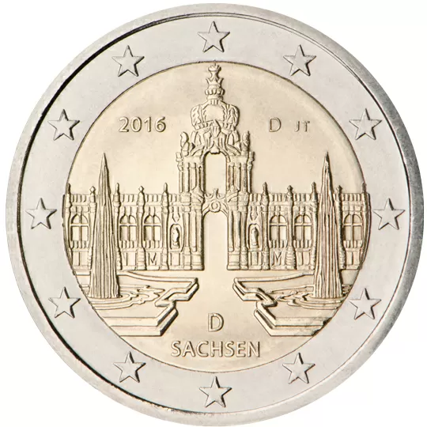

# Germany € 2.00

## Images

## Metadata

**Country:** [Germany](../../Countries/Germany/index.md)\
**Serie:** [German federal states](index.md)\
**Monetary value:** € 2.00\
**Currency:** Euro\
**Issue date:** 2016-02-05

## Description

Federal state of Saxony

## Mintages

| Year | Mintmark | Circulated | Brilliant Uncirculated | Proof |
| ---- | -------- | ---------- | ---------------------- | ----- |
| 2016 | A        | 6000000    | 34800                  | 30000 |
| 2016 | D        | 6300000    | 30000                  | 24000 |
| 2016 | F        | 7200000    | 30000                  | 24000 |
| 2016 | G        | 4200000    | 30000                  | 24000 |
| 2016 | J        | 6300000    | 30000                  | 24000 |
