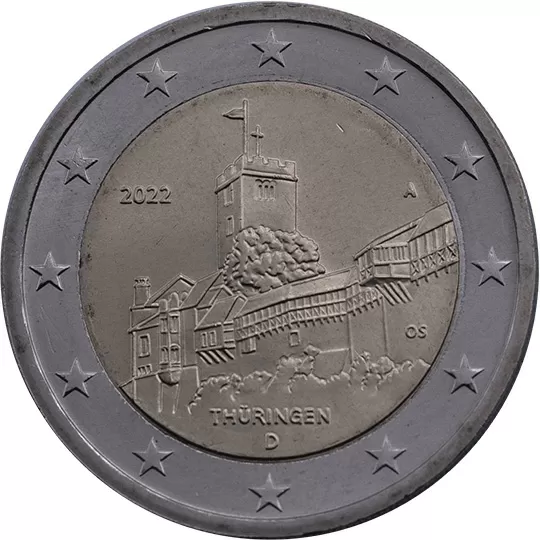

# Germany € 2.00

## Images

## Metadata

**Country:** [Germany](../../Countries/Germany/index.md)\
**Serie:** [German federal states](index.md)\
**Monetary value:** € 2.00\
**Currency:** Euro\
**Issue date:** 2022-01-25

## Description

Federal state of Thuringia

## Mintages

| Year | Mintmark | Circulated | Brilliant Uncirculated | Proof |
| ---- | -------- | ---------- | ---------------------- | ----- |
| 2022 | A        | 6000000    | 18200                  | 16900 |
| 2022 | D        | 6300000    | 16100                  | 13300 |
| 2022 | F        | 7200000    | 15500                  | 12800 |
| 2022 | G        | 4200000    | 15700                  | 13000 |
| 2022 | J        | 6300000    | 15600                  | 12800 |
