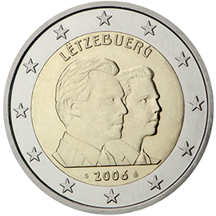

# Luxembourg € 2.00

## Images

## Metadata

**Country:** [Luxembourg](../../Countries/Luxembourg/index.md)\
**Monetary value:** € 2.00\
**Currency:** Euro\
**Issue date:** 2006-02-08

## Description

25th birthday of Grand-Duke Guillaume, heir to the throne

## Mintages

| Year | Mintmark | Circulated | Brilliant Uncirculated | Proof |
| ---- | -------- | ---------- | ---------------------- | ----- |
| 2006 |          | 1000000    | 15000                  | 0     |
