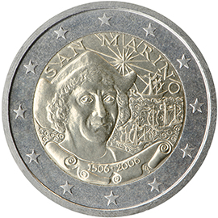

# San Marino € 2.00

## Images

## Metadata

**Country:** [San Marino](../../Countries/San Marino/index.md)\
**Monetary value:** € 2.00\
**Currency:** Euro\
**Issue date:** 2006-10-17

## Description

500th anniversary of Christopher Columbus' death

## Mintages

| Year | Mintmark | Circulated | Brilliant Uncirculated | Proof |
| ---- | -------- | ---------- | ---------------------- | ----- |
| 2006 |          | 0          | 120000                 | 0     |
