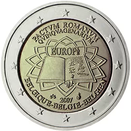

# Belgium € 2.00

## Images

## Metadata

**Country:** [Belgium](../../Countries/Belgium/index.md)\
**Serie:** [Treaty of Rome](index.md)\
**Monetary value:** € 2.00\
**Currency:** Euro\
**Issue date:** 2007-03-25

## Description

50 years treaty of Rome

## Mintages

| Year | Mintmark | Circulated | Brilliant Uncirculated | Proof |
| ---- | -------- | ---------- | ---------------------- | ----- |
| 2007 |          | 5000000    | 35000                  | 5000  |
