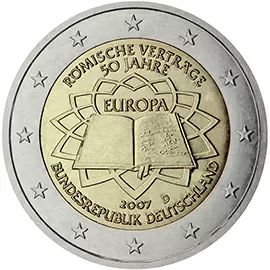

# Germany € 2.00

## Images

## Metadata

**Country:** [Germany](../../Countries/Germany/index.md)\
**Serie:** [Treaty of Rome](index.md)\
**Monetary value:** € 2.00\
**Currency:** Euro\
**Issue date:** 2007-03-25

## Description

50 years treaty of Rome

## Mintages

| Year | Mintmark | Circulated | Brilliant Uncirculated | Proof  |
| ---- | -------- | ---------- | ---------------------- | ------ |
| 2007 | A        | 1000000    | 90000                  | 75000  |
| 2007 | D        | 14500000   | 90000                  | 75000  |
| 2007 | F        | 8000000    | 90000                  | 75000  |
| 2007 | G        | 5000000    | 90000                  | 75000  |
| 2007 | J        | 1500000    | 90000                  | 75000  |
