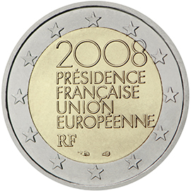

# France € 2.00

## Images

## Metadata

**Country:** [France](../../Countries/France/index.md)\
**Monetary value:** € 2.00\
**Currency:** Euro\
**Issue date:** 2008-07-01

## Description

French Presidency of the Council of the European Union in the second half of 2008

## Mintages

| Year | Mintmark | Circulated | Brilliant Uncirculated | Proof |
| ---- | -------- | ---------- | ---------------------- | ----- |
| 2008 |          | 20000000   | 25000                  | 10000 |
