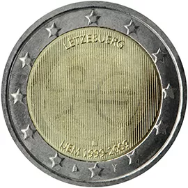

# Luxembourg € 2.00

## Images

## Metadata

**Country:** [Luxembourg](../../Countries/Luxembourg/index.md)\
**Serie:** [European Economic and Monetary Union](index.md)\
**Monetary value:** € 2.00\
**Currency:** Euro\
**Issue date:** 2009-01-01

## Description

10 years of European Economic and Monetary Union

## Mintages

| Year | Mintmark | Circulated | Brilliant Uncirculated | Proof |
| ---- | -------- | ---------- | ---------------------- | ----- |
| 2009 |          | 800000     | 10000                  | 0     |
