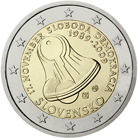

# Slovakia € 2.00

## Images

## Metadata

**Country:** [Slovakia](../../Countries/Slovakia/index.md)\
**Monetary value:** € 2.00\
**Currency:** Euro\
**Issue date:** 2009-11-10

## Description

20th anniversary of 17 November 1989 (Day of the fight for freedom and democracy)

## Mintages

| Year | Mintmark | Circulated | Brilliant Uncirculated | Proof |
| ---- | -------- | ---------- | ---------------------- | ----- |
| 2009 |          | 992000     | 8000                   | 0     |
