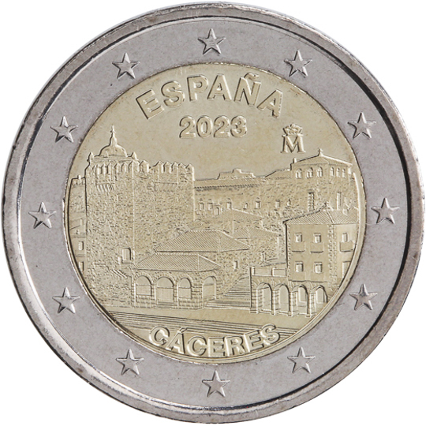

# Spain € 2.00

## Images

## Metadata

**Country:** [Spain](../../Countries/Spain/index.md)\
**Serie:** [Spanish UNESCO World Heritage](index.md)\
**Monetary value:** € 2.00\
**Currency:** Euro\
**Issue date:** 2023-03-28

## Description
UNESCO: Cáceres

## Mintages

| Year | Mintmark | Circulated | Brilliant Uncirculated | Proof |
| ---- | -------- | ---------- | ---------------------- | ----- |
| 2023 |          | 1500000    | 0                      | 5000  |
