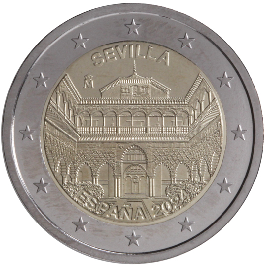

# Spain € 2.00

## Images

## Metadata

**Country:** [Spain](../../Countries/Spain/index.md)\
**Serie:** [Spanish UNESCO World Heritage](index.md)\
**Monetary value:** € 2.00\
**Currency:** Euro\
**Issue date:** 2024-02-02

## Description
The recognition of Seville (Archivo de Indias, Real Alcazar de Sevilla y Catedral de Sevilla) as a UNESCO World Heritage Site

## Mintages

| Year | Mintmark | Circulated | Brilliant Uncirculated | Proof |
| ---- | -------- | ---------- | ---------------------- | ----- |
| 2024 |          | 0          | 0                      | 0     |
