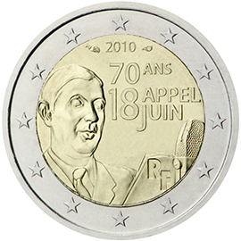

# France € 2.00

## Images

## Metadata

**Country:** [France](../../Countries/France/index.md)\
**Monetary value:** € 2.00\
**Currency:** Euro\
**Issue date:** 2010-05-25

## Description

70th anniversary of the Appeal of June 18

## Mintages

| Year | Mintmark | Circulated | Brilliant Uncirculated | Proof |
| ---- | -------- | ---------- | ---------------------- | ----- |
| 2010 |          | 20000000   | 23200                  | 500   |
