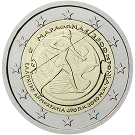

# Greece € 2.00

## Images

## Metadata

**Country:** [Greece](../../Countries/Greece/index.md)\
**Monetary value:** € 2.00\
**Currency:** Euro\
**Issue date:** 2010-10-25

## Description

2.500th anniversary of the Battle of Marathon

## Mintages

| Year | Mintmark | Circulated | Brilliant Uncirculated | Proof |
| ---- | -------- | ---------- | ---------------------- | ----- |
| 2010 |          | 2500000    | 0                      | 0     |
