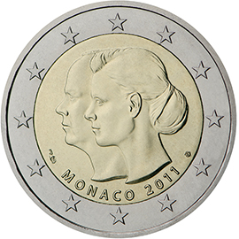

# Monaco € 2.00

## Images

## Metadata

**Country:** [Monaco](../../Countries/Monaco/index.md)\
**Monetary value:** € 2.00\
**Currency:** Euro\
**Issue date:** 2011-07-02

## Description

The wedding of Prince Albert and Charlene Wittstock

## Mintages

| Year | Mintmark | Circulated | Brilliant Uncirculated | Proof |
| ---- | -------- | ---------- | ---------------------- | ----- |
| 2011 |          | 88000      | 59000                  | 0     |
