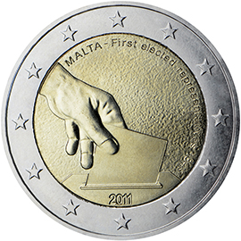

# Malta € 2.00

## Images

## Metadata

**Country:** [Malta](../../Countries/Malta/index.md)\
**Monetary value:** € 2.00\
**Currency:** Euro\
**Issue date:** 2011-10-17

## Description

Constitutional history – first election of representatives in 1849

## Mintages

| Year | Mintmark | Circulated | Brilliant Uncirculated | Proof |
| ---- | -------- | ---------- | ---------------------- | ----- |
| 2011 |          | 0          | 350000                 | 5000  |
