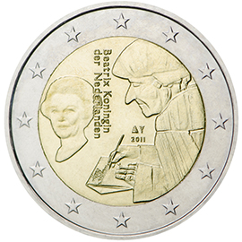

# Netherlands € 2.00

## Images

## Metadata

**Country:** [Netherlands](../../Countries/Netherlands/index.md)\
**Monetary value:** € 2.00\
**Currency:** Euro\
**Issue date:** 2011-01-24

## Description

The 500th anniversary of the publication of the world-famous book "Laus Stultitiae" by the Dutch philosopher, humanist and theologian Desiderius Erasmus

## Mintages

| Year | Mintmark | Circulated | Brilliant Uncirculated | Proof |
| ---- | -------- | ---------- | ---------------------- | ----- |
| 2011 |          | 3973000    | 10000                  | 2000  |
