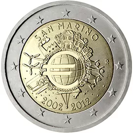

# San Marino € 2.00

## Images

## Metadata

**Country:** [San Marino](../../Countries/San Marino/index.md)\
**Serie:** [introduction of euro coins and banknotes](index.md)\
**Monetary value:** € 2.00\
**Currency:** Euro\
**Issue date:** 2012-06-19

## Description

10th anniversary of the introduction of euro coins and banknotes

## Mintages

| Year | Mintmark | Circulated | Brilliant Uncirculated | Proof |
| ---- | -------- | ---------- | ---------------------- | ----- |
| 2012 |          | 125000     | 0                      | 0     |
