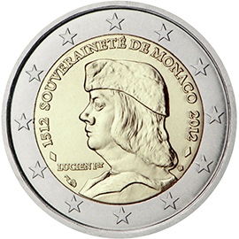

# Monaco € 2.00

## Images

## Metadata

**Country:** [Monaco](../../Countries/Monaco/index.md)\
**Monetary value:** € 2.00\
**Currency:** Euro\
**Issue date:** 2012-09-10

## Description

500th anniversary of the establishment of Monaco’s sovereignty by Lucien I Grimaldi

## Mintages

| Year | Mintmark | Circulated | Brilliant Uncirculated | Proof |
| ---- | -------- | ---------- | ---------------------- | ----- |
| 2012 |          | 98500      | 0                      | 10000 |
