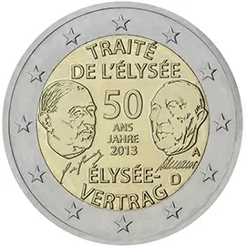

# Germany € 2.00

## Images

## Metadata

**Country:** [Germany](../../Countries/Germany/index.md)\
**Serie:** [Élysée treaty](index.md)\
**Monetary value:** € 2.00\
**Currency:** Euro\
**Issue date:** 2013-01-22

## Description

50 years Élysée treaty

## Mintages

| Year | Mintmark | Circulated | Brilliant Uncirculated | Proof |
| ---- | -------- | ---------- | ---------------------- | ----- |
| 2013 | A        | 2200000    | 37380                  | 31000 |
| 2013 | D        | 2310000    | 37000                  | 31000 |
| 2013 | F        | 2640000    | 37000                  | 31000 |
| 2013 | G        | 1540000    | 37000                  | 31000 |
| 2013 | J        | 2310000    | 37000                  | 31000 |
