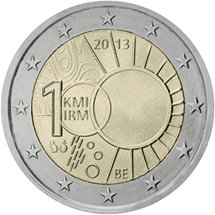

# Belgium € 2.00

## Images

## Metadata

**Country:** [Belgium](../../Countries/Belgium/index.md)\
**Monetary value:** € 2.00\
**Currency:** Euro\
**Issue date:** 2013-09-18

## Description

100th anniversary of the creation of the Royal Meteorological Institute (Koninklijk Meteorologisch Instituut/Institut Royal Météorologique)

## Mintages

| Year | Mintmark | Circulated | Brilliant Uncirculated | Proof |
| ---- | -------- | ---------- | ---------------------- | ----- |
| 2013 |          | 2000000    | 5000                   | 5000  |
