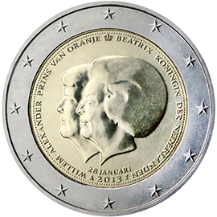

# Netherlands € 2.00

## Images

## Metadata

**Country:** [Netherlands](../../Countries/Netherlands/index.md)\
**Monetary value:** € 2.00\
**Currency:** Euro\
**Issue date:** 2013-02-07

## Description

The announcement of the abdication of the throne by Her Majesty Queen Beatrix

## Mintages

| Year | Mintmark | Circulated | Brilliant Uncirculated | Proof |
| ---- | -------- | ---------- | ---------------------- | ----- |
| 2013 |          | 19715000   | 250000                 | 10000 |
