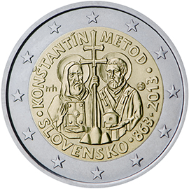

# Slovakia € 2.00

## Images

## Metadata

**Country:** [Slovakia](../../Countries/Slovakia/index.md)\
**Monetary value:** € 2.00\
**Currency:** Euro\
**Issue date:** 2013-07-05

## Description

1150th anniversary of the advent of the mission of Constantine and Methodius to Great Moravia

## Mintages

| Year | Mintmark | Circulated | Brilliant Uncirculated | Proof |
| ---- | -------- | ---------- | ---------------------- | ----- |
| 2013 |          | 976700     | 7000                   | 0     |
