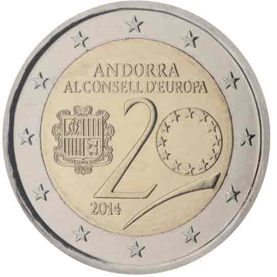

# Andorra € 2.00

## Images

## Metadata

**Country:** [Andorra](../../Countries/Andorra/index.md)\
**Monetary value:** € 2.00\
**Currency:** Euro\

## Description

20 years in the Council of Europe

## Mintages

| Year | Mintmark | Circulated | Brilliant Uncirculated | Proof |
| ---- | -------- | ---------- | ---------------------- | ----- |
| 2014 |          | 0          | 100000                 | 5000  |
