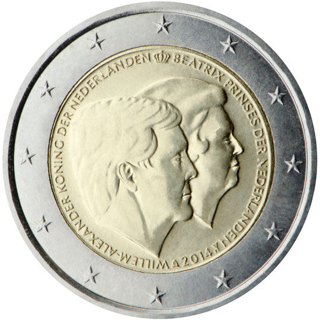

# Netherlands € 2.00

## Images

## Metadata

**Country:** [Netherlands](../../Countries/Netherlands/index.md)\
**Monetary value:** € 2.00\
**Currency:** Euro\
**Issue date:** 2014-05-22

## Description

The official farewell to the former Queen Beatrix

## Mintages

| Year | Mintmark | Circulated | Brilliant Uncirculated | Proof |
| ---- | -------- | ---------- | ---------------------- | ----- |
| 2014 |          | 5000000    | 25000                  | 3000 |
