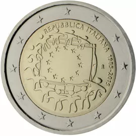

# Italy € 2.00

## Images

## Metadata

**Country:** [Italy](../../Countries/Italy/index.md)\
**Serie:** [European flag](index.md)\
**Monetary value:** € 2.00\
**Currency:** Euro\
**Issue date:** 2015-08-06

## Description

30 years European flag

## Mintages

| Year | Mintmark | Circulated | Brilliant Uncirculated | Proof |
| ---- | -------- | ---------- | ---------------------- | ----- |
| 2015 |          | 1000000    | 0                      | 5000  |
