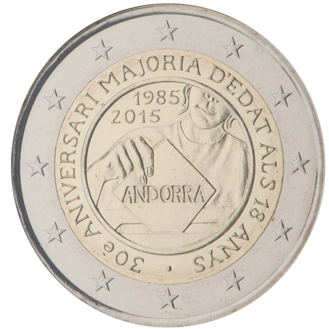

# Andorra € 2.00

## Images

## Metadata

**Country:** [Andorra](../../Countries/Andorra/index.md)\
**Monetary value:** € 2.00\
**Currency:** Euro\
**Issue date:** 2016-07-18

## Description

30th anniversary of the Coming of Age and Political Rights to the Men and Women turning 18 years old

## Mintages

| Year | Mintmark | Circulated | Brilliant Uncirculated | Proof |
| ---- | -------- | ---------- | ---------------------- | ----- |
| 2015 |          | 0          | 85000                  | 0     |
