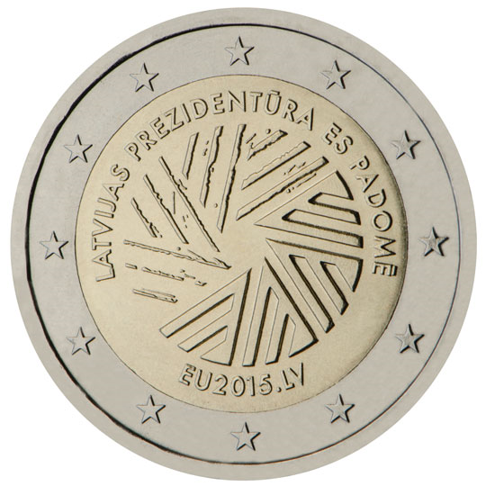

# Latvia € 2.00

## Images

## Metadata

**Country:** [Latvia](../../Countries/Latvia/index.md)\
**Monetary value:** € 2.00\
**Currency:** Euro\
**Issue date:** 2015-02-10

## Description

Latvian Presidency of the Council of the European Union

## Mintages

| Year | Mintmark | Circulated | Brilliant Uncirculated | Proof |
| ---- | -------- | ---------- | ---------------------- | ----- |
| 2015 |          | 1000000    | 5000                   |       |
