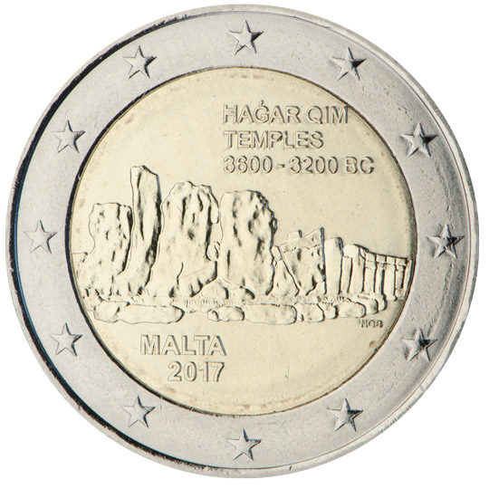

# Malta € 2.00

## Images

## Metadata

**Country:** [Malta](../../Countries/Malta/index.md)\
**Serie:** [Maltese Temples](index.md)\
**Monetary value:** € 2.00\
**Currency:** Euro\
**Issue date:** 2017-05-31

## Description

Unesco World Heritage Site: Maltese prehistoric temples of Hagar Qim

## Mintages

| Year | Mintmark | Circulated | Brilliant Uncirculated | Proof |
| ---- | -------- | ---------- | ---------------------- | ----- |
| 2017 |          |            | 350000                 | 0     |
| 2017 | F        |            | 25000                  | 0     |
