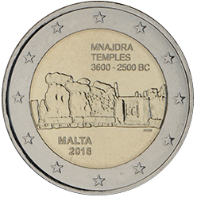

# Malta € 2.00

## Images

## Metadata

**Country:** [Malta](../../Countries/Malta/index.md)\
**Serie:** [Maltese Temples](index.md)\
**Monetary value:** € 2.00\
**Currency:** Euro\
**Issue date:** 2018-06-21

## Description

Unesco World Heritage Site — Temples of Mnajdra

## Mintages

| Year | Mintmark | Circulated | Brilliant Uncirculated | Proof |
| ---- | -------- | ---------- | ---------------------- | ----- |
| 2018 |          | 0          | 320000                 | 0     |
| 2018 | F        | 0          | 15000                  | 0     |
