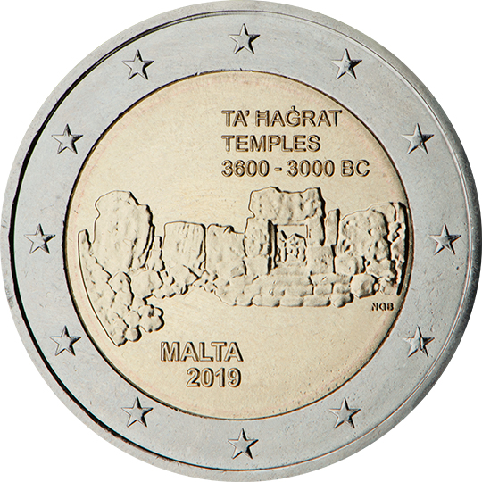

# Malta € 2.00

## Images

## Metadata

**Country:** [Malta](../../Countries/Malta/index.md)\
**Serie:** [Maltese Temples](index.md)\
**Monetary value:** € 2.00\
**Currency:** Euro\
**Issue date:** 2019-05-13

## Description

Unesco World Heritage Site – pre-historic temples of Ta’ Haġrat

## Mintages

| Year | Mintmark | Circulated | Brilliant Uncirculated | Proof |
| ---- | -------- | ---------- | ---------------------- | ----- |
| 2019 |          | 0          | 300000                 | 0     |
| 2019 | F        | 0          | 15000                  | 0     |
