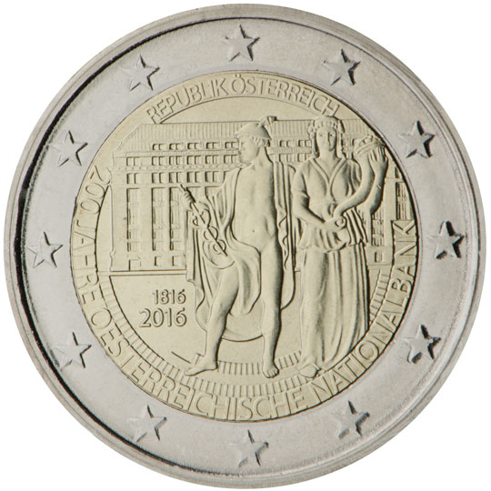

# Austria € 2.00

## Images

## Metadata

**Country:** [Austria](../../Countries/Austria/index.md)\
**Monetary value:** € 2.00\
**Currency:** Euro\
**Issue date:** 2015-12-02

## Description

200 years of Oesterreichische Nationalbank

## Mintages

| Year | Mintmark | Circulated | Brilliant Uncirculated | Proof |
| ---- | -------- | ---------- | ---------------------- | ----- |
| 2016 |          | 15940000   | 50000                  | 10000 |
