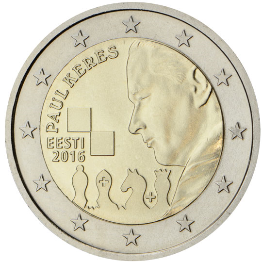

# Estonia € 2.00

## Images

## Metadata

**Country:** [Estonia](../../Countries/Estonia/index.md)\
**Monetary value:** € 2.00\
**Currency:** Euro\
**Issue date:** 2016-01-07

## Description

100th anniversary of the birth of the famous Estonian chess grandmaster Paul Keres

## Mintages

| Year | Mintmark | Circulated | Brilliant Uncirculated | Proof |
| ---- | -------- | ---------- | ---------------------- | ----- |
| 2016 |          | 495000     | 5000                   | 0     |
