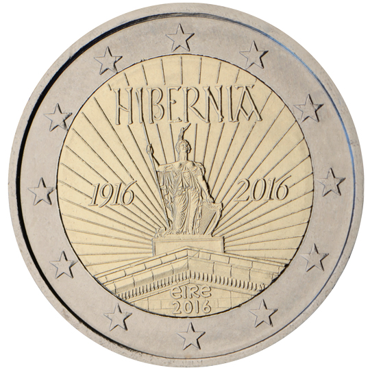

# Ireland € 2.00

## Images

## Metadata

**Country:** [Ireland](../../Countries/Ireland/index.md)\
**Monetary value:** € 2.00\
**Currency:** Euro\
**Issue date:** 2016-01-20

## Description

100 years since the 1916 Easter Rising in Ireland

## Mintages

| Year | Mintmark | Circulated | Brilliant Uncirculated | Proof |
| ---- | -------- | ---------- | ---------------------- | ----- |
| 2016 |          | 4400000    | 75000                  | 54000 |
