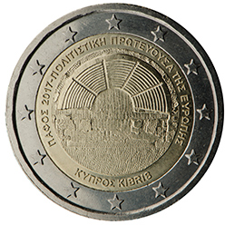

# Cyprus € 2.00

## Images

## Metadata

**Country:** [Cyprus](../../Countries/Cyprus/index.md)\
**Monetary value:** € 2.00\
**Currency:** Euro\
**Issue date:** 2017-11-03

## Description

Paphos 2017 – European Capital of Culture

## Mintages

| Year | Mintmark | Circulated | Brilliant Uncirculated | Proof |
| ---- | -------- | ---------- | ---------------------- | ----- |
| 2017 |          | 430000     | 0                      | 5000  |
