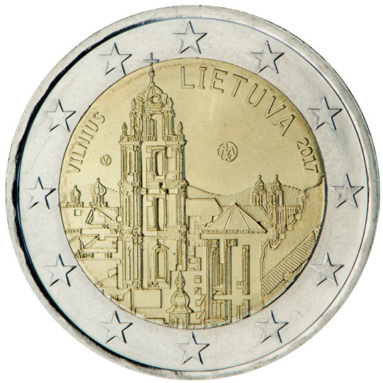

# Lithuania € 2.00

## Images

## Metadata

**Country:** [Lithuania](../../Countries/Lithuania/index.md)\
**Monetary value:** € 2.00\
**Currency:** Euro\
**Issue date:** 2017-08-31

## Description

Vilnius

## Mintages

| Year | Mintmark | Circulated | Brilliant Uncirculated | Proof |
| ---- | -------- | ---------- | ---------------------- | ----- |
| 2017 |          | 990000     | 10000                  | 0     |
