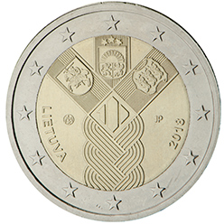

# Lithuania € 2.00

## Images

## Metadata

**Country:** [Lithuania](../../Countries/Lithuania/index.md)\
**Serie:** [Establishment of the Baltic States](index.md)\
**Monetary value:** € 2.00\
**Currency:** Euro\
**Issue date:** 2018-01-31

## Description

Estonia, Latvia and Lithuania jointly issued a commemorative euro coin with a common design in 2018, celebrating the establishment of the States of Estonia and Latvia and the re-establishment of the State of Lithuania

## Mintages

| Year | Mintmark | Circulated | Brilliant Uncirculated | Proof |
| ---- | -------- | ---------- | ---------------------- | ----- |
| 2018 |          | 995000     | 5000                   | 0     |
