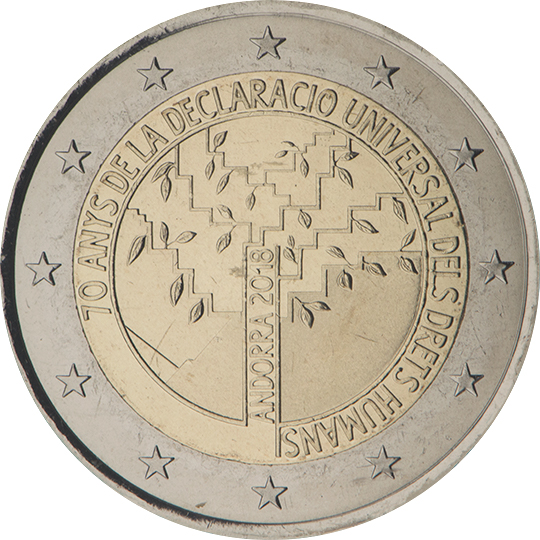

# Andorra € 2.00

## Images

## Metadata

**Country:** [Andorra](../../Countries/Andorra/index.md)\
**Monetary value:** € 2.00\
**Currency:** Euro\
**Issue date:** 2018-11-26

## Description

70 years of the Universal Declaration of Human Rights

## Mintages

| Year | Mintmark | Circulated | Brilliant Uncirculated | Proof |
| ---- | -------- | ---------- | ---------------------- | ----- |
| 2018 |          | 0          | 75000                  | 0     |
