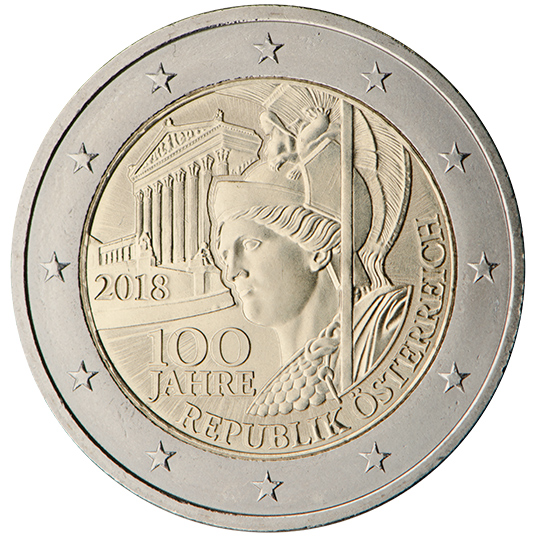

# Austria € 2.00

## Images

## Metadata

**Country:** [Austria](../../Countries/Austria/index.md)\
**Monetary value:** € 2.00\
**Currency:** Euro\
**Issue date:** 2017-12-06

## Description

100 years of the Austrian Republic

## Mintages

| Year | Mintmark | Circulated | Brilliant Uncirculated | Proof |
| ---- | -------- | ---------- | ---------------------- | ----- |
| 2018 |          | 18040000   | 50000                  | 10000 |
