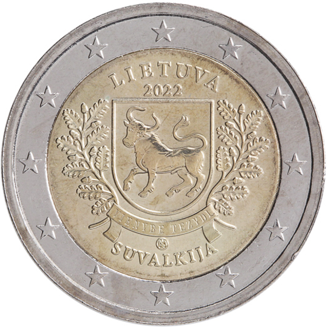

# Lithuania € 2.00

## Images

## Metadata

**Country:** [Lithuania](../../Countries/Lithuania/index.md)\
**Serie:** [Lithuanian Regions](index.md)\
**Monetary value:** € 2.00\
**Currency:** Euro\
**Issue date:** 2022-12-20

## Description
Lithuanian Ethnographic Regions - Suvalkija

## Mintages

| Year | Mintmark | Circulated | Brilliant Uncirculated | Proof |
| ---- | -------- | ---------- | ---------------------- | ----- |
| 2022 |          | 495000     | 5000                   | 0     |
